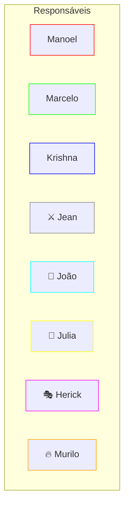
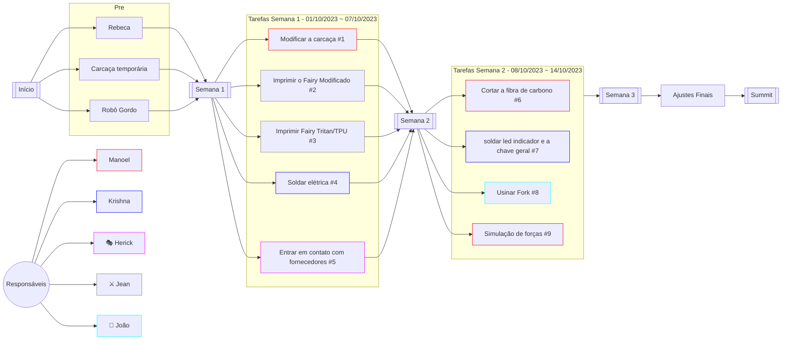
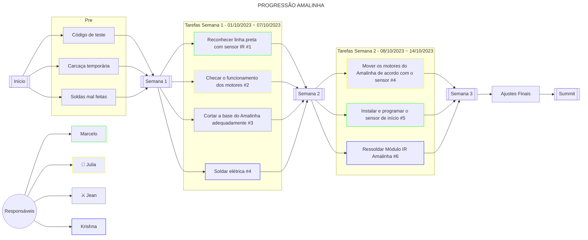
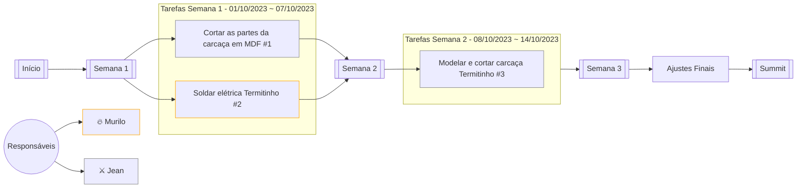

# Equipe SJBots

Esta organização visa concentrar os códigos da Equipe SJBots que surgiu como um projeto do [LabIFMaker São João da barra][LinkLabMaker].

## Diagramas

### Responsáveis

### [Raia][LinkCombots]

### [Amalinha][LinkAmalinha]

### [Termitinho][LinkTermitinho]

## Participantes

| Integrante                                           | Cargo                                   | Bolsa                                      | Vigência          |
| ---------------------------------------------------- | --------------------------------------- | ------------------------------------------ | ----------------- |
| [Allysson Rodrigues Teixeira Tavares][Link_Allysson] | Coordenador                             | Orientador                                 | 2023/01 ~ ...     |
| [Jean Carlos Barreto Henriques Filho][Link_Jean]     | Modelagem 3D; Manutenção do laboratório | Laboratório - Superior                     | 2023/01 ~ ...     |
| [Karine Silva Rangel][Link_Karine]                   | Organização; Gestão; Marketing          | Laboratório - Superior                     | 2023/01 ~ ...     |
| [Herick Alexandre Neves Gonçalves][Link_Herick]      | Programação                             | Iniciação Tecnológica - Superior           | 2023/01 ~ ...     |
| [João Vítor Fernandes Dias][Link_João]               | Líder; Piloto; Elétrica                 | Iniciação Tecnológica - Superior           | 2023/01 ~ ...     |
| [Maria Rebeca Corrêa de Sá][Link_Maria]              | Engenharia; Modelagem 3D                | Iniciação Tecnológica - Superior           | 2023/01 ~ 2023/10 |
| [Murilo Menezes Rangel][Link_Murilo]                 | Elétrica                                | Iniciação Científica Júnior - Ensino Médio | 2023/03 ~ 2023/10 |
| [Allan Arruda Rocha Dias][Link_Allan]                | Voluntário                              | Voluntário - Ensino Médio                  | 2023/03 ~ ...     |
| [Krishna Loterio Gamboa][Link_Krishna]               | Voluntário                              | Voluntário - Ensino Médio                  | 2023/03 ~ ...     |
| [Murilo Menezes Rangel][Link_Murilo]                 | Voluntário                              | Voluntário - Ensino Médio                  | 2023/10 ~ ...     |
| [Julia Pessanha Machado da Silva][Link_Murilo]       | Voluntário                              | Voluntário - Ensino Médio                  | 2023/10 ~ ...     |
| [Marcelo Ecard Souza dos Anjos][Link_Marcelo]        | Elétrica                                | Jovens Talentos - Ensino Médio             | 2023/10 ~ ...     |

## Sites Úteis

- Módulos do Fritzing: [Arduino Modules][LinkArduinoModules]
- Esquemas elétricos: [Scheme-It][LinkSchemeIt]
- [Material de estudo do Lismael][LinkDriveLismael]
- [Modelos 3D Fingertech](https://www.fingertechrobotics.com/index.php)
- [GrabCAD](https://grabcad.com/library)

## Grupos de WhatsApp

- [VSSS][VSSS BR]
- [ArtBot][ArtBot BR]
- [Hockeys][Hockeys] - A diferença é a foto de perfil (e a quantidade de gente)
- [Hockeys][Hockeys BR] - A diferença é a foto de perfil (e a quantidade de gente)
- [Areninha][Areninha]
- [Impressão 3D][Impressão 3D Brasil]
- [Sumô de Robôs][Sumô de Robôs BR]
- [Categoria Cupim][Categoria Cupim]
- [Guerra de Robôs][Guerra de Robôs]
- [Seguidor de Linha][Seguidor de Linha BR]
- [Guerra de Robôs (sério)][Guerra de Robôs (sério)]
- [Impressão 3D - Guerra de Robôs][Impressão 3D - Guerra de Robôs]

### RJ

- [RJ - Combate][Combate RJ]
- [RJ - Robótica][Robótica RJ]

### Competições

- [IRONCup 2024][IRONCup 2024]
- [4º Summit Nacional de Robótica][4º Summit Nacional de Robótica]

<!-- ## Links -->

<!-- ### Grupos -->

[VSSS BR]: https://chat.whatsapp.com/GGQWEJd6MAiBYe5u1thluH
[Hockeys]: https://chat.whatsapp.com/CAIO5oCqZcpHTBeUwM4347
[Areninha]: https://chat.whatsapp.com/G75cAFL1zIU3ST5fdk17M5
[ArtBot BR]: https://chat.whatsapp.com/BXMSQ6iBZ9b792aG2I1yYy
[Hockeys BR]: https://chat.whatsapp.com/LkKavdw9Opp8J1uln7dV4S
[Combate RJ]: https://chat.whatsapp.com/FadAHLT8pOoLmbCUI0WQ8o
[Robótica RJ]: https://chat.whatsapp.com/GjA9lSFv4qeHW5s6OvjXD0
[IRONCup 2024]: https://chat.whatsapp.com/Fwv7ZnfGzbeH2pXnKLAaBo
[Categoria Cupim]: https://chat.whatsapp.com/IQNhyKFpT8s7wUhXp9DqlT
[Guerra de Robôs]: https://chat.whatsapp.com/B8sLR2Al0UkEI26f12fLha
[Sumô de Robôs BR]: https://chat.whatsapp.com/D8Z5p4fXTLCGTwzOUwecf3
[Impressão 3D Brasil]: https://chat.whatsapp.com/LmMG5E0L9bc9RD8ruB9tXm
[Seguidor de Linha BR]: https://chat.whatsapp.com/DR6eKw7h3QsCIDOppnp4ab
[Guerra de Robôs (sério)]: https://chat.whatsapp.com/G3bgpgqo4MQGABz9weoUOK
[Impressão 3D - Guerra de Robôs]: https://chat.whatsapp.com/KnYjfaJHrvbADVTswcg7lG
[4º Summit Nacional de Robótica]: https://chat.whatsapp.com/KqRYx0d7HE45kKCCjgpUZE

<!-- ### Repositórios -->

[LinkMisc]: https://github.com/Equipe-SJBots/misc
[LinkCombots]: https://github.com/Equipe-SJBots/combots
[LinkAmalinha]: https://github.com/Equipe-SJBots/amalinha
[LinkTermitinho]: https://github.com/Equipe-SJBots/termitinho

<!-- ### Links pessoais -->

[LinkLabMaker]: https://www.instagram.com/labmakersjb/
[Link_Allysson]: https://www.linkedin.com/in/allysson-tavares-92291632/
[Link_Jean]: https://github.com/
[Link_Karine]: https://www.instagram.com/arquirine/
[Link_Herick]: https://github.com/JohtoGamesOf
[Link_João]: https://github.com/jvfd3
[Link_Maria]: https://github.com/
[Link_Murilo]: https://github.com/
[Link_Allan]: https://github.com/
[Link_Krishna]: https://github.com/JulhoGamboa
[Link_Marcelo]: https://github.com/

<!-- ### Links úteis -->

[LinkSchemeIt]: https://www.digikey.com.br/en/schemeit/project
[LinkArduinoModules]: https://arduinomodules.info/
[LinkDriveLismael]: https://drive.google.com/drive/folders/1Q4MfL3113gF4aEw8RkMEwNNp9x54CAKh

