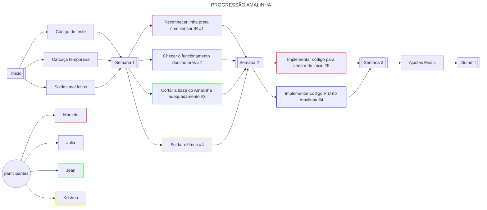

# Equipe SJBots

Esta organização visa concentrar os códigos da Equipe SJBots que surgiu como um projeto do [LabIFMaker São João da barra][LinkLabMaker].

## Participantes

| Integrante                                           | Cargo                                   | Bolsa                                      | Vigência          |
| ---------------------------------------------------- | --------------------------------------- | ------------------------------------------ | ----------------- |
| [Allysson Rodrigues Teixeira Tavares][Link_Allysson] | Coordenador                             | Orientador                                 | 2023/01 ~ ...     |
| [Jean Carlos Barreto Henriques Filho][Link_Jean]     | Modelagem 3D; Manutenção do laboratório | Laboratório - Superior                     | 2023/01 ~ ...     |
| [Karine Silva Rangel][Link_Karine]                   | Organização; Gestão; Marketing          | Laboratório - Superior                     | 2023/01 ~ ...     |
| [Herick Alexandre Neves Gonçalves][Link_Herick]      | Programação                             | Iniciação Tecnológica - Superior           | 2023/01 ~ ...     |
| [João Vítor Fernandes Dias][Link_João]               | Líder; Piloto; Elétrica                 | Iniciação Tecnológica - Superior           | 2023/01 ~ ...     |
| [Maria Rebeca Corrêa de Sá][Link_Maria]              | Engenharia; Modelagem 3D                | Iniciação Tecnológica - Superior           | 2023/01 ~ 2023/10 |
| [Murilo Menezes Rangel][Link_Murilo]                 | Elétrica                                | Iniciação Científica Júnior - Ensino Médio | 2023/03 ~ 2023/10 |
| [Allan Arruda Rocha Dias][Link_Allan]                | Voluntário                              | Voluntário - Ensino Médio                  | 2023/03 ~ ...     |
| [Krishna Loterio Gamboa][Link_Krishna]               | Voluntário                              | Voluntário - Ensino Médio                  | 2023/03 ~ ...     |
| [Murilo Menezes Rangel][Link_Murilo]                 | Voluntário                              | Voluntário - Ensino Médio                  | 2023/10 ~ ...     |
| [Julia Pessanha Machado da Silva][Link_Murilo]       | Voluntário                              | Voluntário - Ensino Médio                  | 2023/10 ~ ...     |
| [Marcelo Ecard Souza dos Anjos][Link_Marcelo]        | Elétrica                                | Jovens Talentos - Ensino Médio             | 2023/10 ~ ...     |

## Grupos de WhatsApp

- [Areninha][LinkAreninha]
- [Guerra de Robôs][LinkGuerraDeRobos]
- [Seguidor de Linha Brasil][LinkSeguidorDeLinha]
- [Sumô de Robôs Brasil][LinkSumô]
- [ArtBot Brasil][Artbot]
- [Combate Rio][Combate Rio]
- Guerra de Robôs (sério)
- Robótica Rio

[LinkAreninha]: https://chat.whatsapp.com/G75cAFL1zIU3ST5fdk17M5
[LinkGuerraDeRobos]: https://chat.whatsapp.com/B8sLR2Al0UkEI26f12fLha
[LinkSeguidorDeLinha]: https://chat.whatsapp.com/DR6eKw7h3QsCIDOppnp4ab
[LinkSumô]: https://chat.whatsapp.com/D8Z5p4fXTLCGTwzOUwecf3
[Artbot]: https://chat.whatsapp.com/BXMSQ6iBZ9b792aG2I1yYy
[Combate Rio]: https://chat.whatsapp.com/FadAHLT8pOoLmbCUI0WQ8o

## Progressões

### [Amalinha][LinkAmalinha]

[LinkMisc]: https://github.com/Equipe-SJBots/misc
[LinkCombots]: https://github.com/Equipe-SJBots/combots
[LinkAmalinha]: https://github.com/Equipe-SJBots/amalinha
[LinkTermitinho]: https://github.com/Equipe-SJBots/termitinho

<!-- Links -->
[LinkLabMaker]: https://www.instagram.com/labmakersjb/
[Link_Allysson]: https://www.linkedin.com/in/allysson-tavares-92291632/
[Link_Jean]: https://github.com/
[Link_Karine]: https://www.instagram.com/arquirine/
[Link_Herick]: https://github.com/JohtoGamesOf
[Link_João]: https://github.com/jvfd3
[Link_Maria]: https://github.com/
[Link_Murilo]: https://github.com/
[Link_Allan]: https://github.com/
[Link_Krishna]: https://github.com/JulhoGamboa
[Link_Marcelo]: https://github.com/
