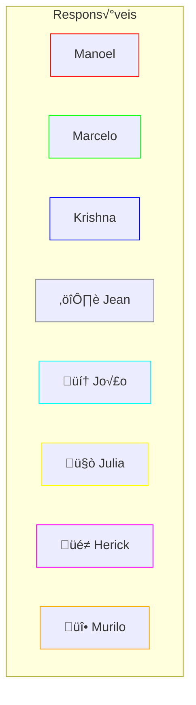
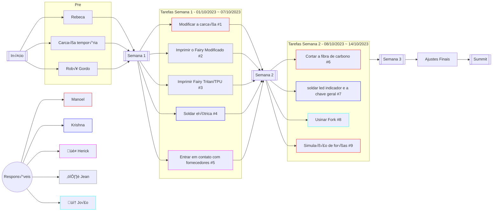
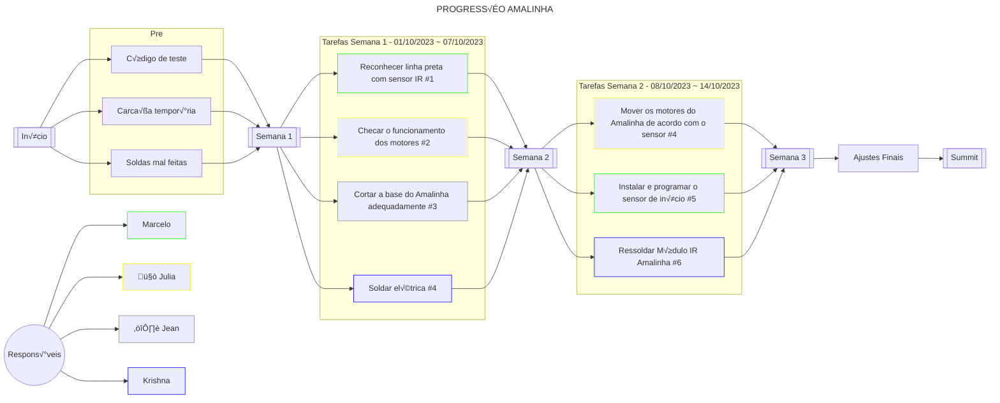
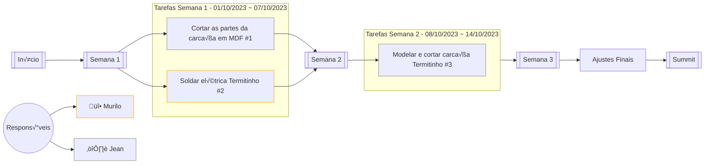

# Equipe SJBots

Esta organização visa concentrar os códigos da Equipe SJBots que surgiu como um projeto do [LabIFMaker São João da barra][LinkLabMaker].

## Diagramas

### Respons√°veis

```mermaid

%% ---
%% title: RESPONSÁVEIS
%% ---
flowchart TD

  subgraph rps [Respons√°veis]
  r1["Manoel"]:::manoel
  r2["Marcelo"]:::marcelo
  r3["Krishna"]:::krishna
  r4["⚔️ Jean"]:::jean
  r5["💠 João"]:::joao
  r6["🤘 Julia"]:::julia
  r7["üé≠ Herick"]:::herick
  r8["üî• Murilo"]:::murilo
  end

  classDef manoel    stroke:#FF0000
  classDef marcelo   stroke:#00FF00
  classDef krishna   stroke:#0000FF
  classDef jean      stroke:#888888
  classDef joao      stroke:#00FFFF
  classDef julia     stroke:#FFFF00
  classDef herick    stroke:#FF00FF
  classDef murilo    stroke:#ffa500
```

### [Raia][LinkCombots]

```mermaid

%% ---
%% title: PROGRESSÃO RAIA
%% ---
flowchart LR

  s0[[Início]]
  s1[[Semana 1]]
  s2[[Semana 2]]
  s3[[Semana 3]]
  af["Ajustes Finais"]
  c1[[Summit]]

  rp((Respons√°veis))
  r1["Manoel"]:::manoel
  r2["Krishna"]:::krishna
  r3["üé≠ Herick"]:::herick
  r4["⚔️ Jean"]:::jean
  r5["💠 João"]:::joao

  subgraph ss0 [Pre]
    p1["Rebeca"]
    p2["Carcaça temporária"]
    p3["Robô Gordo"]
  end

  subgraph ss1 ["Tarefas Semana 1 - 01/10/2023 ~ 07/10/2023"]
    i1["Modificar a carcaça #1"]:::manoel
    i2["Imprimir o Fairy Modificado #2"]:::jean
    i3["Imprimir Fairy Tritan/TPU #3"]:::jean
    i4["Soldar elétrica #4"]:::krishna
    i5["Entrar em contato com fornecedores #5"]:::herick
  end

  subgraph ss2 ["Tarefas Semana 2 - 08/10/2023 ~ 14/10/2023"]
    direction BT
    i6["Cortar a fibra de carbono #6"]:::manoel
    i7["soldar led indicador e a chave geral #7"]:::krishna
    i8["Usinar Fork #8"]:::joao
    i9["Simulação de forças #9"]:::manoel
  end

  s0 --> p1 & p2 & p3 --> s1
  s1 --> i1 & i2 & i3 & i4 & i5 --> s2
  s2 --> i6 & i7 & i8 & i9
  ss2 --> s3 --> af --> c1

  rp --> r1 & r2 & r3 & r4 & r5

  click i1 "https://github.com/Equipe-SJBots/combots/issues/1"
  click i2 "https://github.com/Equipe-SJBots/combots/issues/2"
  click i3 "https://github.com/Equipe-SJBots/combots/issues/3"
  click i4 "https://github.com/Equipe-SJBots/combots/issues/4"
  click i5 "https://github.com/Equipe-SJBots/combots/issues/5"

  click i6 "https://github.com/Equipe-SJBots/combots/issues/6"
  click i7 "https://github.com/Equipe-SJBots/combots/issues/7"
  click i8 "https://github.com/Equipe-SJBots/combots/issues/8"
  click i9 "https://github.com/Equipe-SJBots/combots/issues/9"

  classDef manoel    stroke:#FF0000
  classDef marcelo   stroke:#00FF00
  classDef krishna   stroke:#0000FF
  classDef jean      stroke:#888888
  classDef joao      stroke:#00FFFF
  classDef julia     stroke:#FFFF00
  classDef herick    stroke:#FF00FF
  classDef murilo    stroke:#ffa500
```

### [Amalinha][LinkAmalinha]

```mermaid

---
title: PROGRESSÃO AMALINHA
---
flowchart LR
  s0[[Início]]
  s1[[Semana 1]]
  s2[[Semana 2]]
  s3[[Semana 3]]
  af["Ajustes Finais"]
  c1[[Summit]]

  rp((Respons√°veis))
  r1["Marcelo"]:::marcelo
  r2["🤘 Julia"]:::julia
  r3["⚔️ Jean"]:::jean
  r4["Krishna"]:::krishna

  subgraph ss0 [Pre]
    p1["Código de teste"]
    p2["Carcaça temporária"]
    p3["Soldas mal feitas"]
  end

  subgraph ss1 ["Tarefas Semana 1 - 01/10/2023 ~ 07/10/2023"]
    i1["Reconhecer linha preta com sensor IR #1"]:::marcelo
    i2["Checar o funcionamento dos motores #2"]:::julia
    i3["Cortar a base do Amalinha adequadamente #3"]:::jean
    cbt4["Soldar elétrica #4"]:::krishna
  end

  subgraph ss2 ["Tarefas Semana 2 - 08/10/2023 ~ 14/10/2023"]
    i4["Mover os motores do Amalinha de acordo com o sensor #4"]:::julia
    i5["Instalar e programar o sensor de início #5"]:::marcelo
    i6["Ressoldar Módulo IR Amalinha #6"]:::krishna
  end

  s0 --> p1 & p2 & p3 --> s1
  s1 --> i1 & i2 & i3 & cbt4 --> s2
  s2 --> i4 & i5 & i6 --> s3
  s3 --> af --> c1

  rp --> r1 & r2 & r3 & r4

  click i1 "https://github.com/Equipe-SJBots/amalinha/issues/1"
  click i2 "https://github.com/Equipe-SJBots/amalinha/issues/2"
  click i3 "https://github.com/Equipe-SJBots/amalinha/issues/3"
  click cbt4 "https://github.com/Equipe-SJBots/combots/issues/4"
  click i4 "https://github.com/Equipe-SJBots/amalinha/issues/4"
  click i5 "https://github.com/Equipe-SJBots/amalinha/issues/5"
  click i6 "https://github.com/Equipe-SJBots/amalinha/issues/6"


  classDef manoel    stroke:#FF0000
  classDef marcelo   stroke:#00FF00
  classDef krishna   stroke:#0000FF
  classDef jean      stroke:#888888
  classDef joao      stroke:#00FFFF
  classDef julia     stroke:#FFFF00
  classDef herick    stroke:#FF00FF
  classDef murilo    stroke:#ffa500
```

### [Termitinho][LinkTermitinho]

```mermaid

%% ---
%% title: PROGRESSÃO TERMITINHO
%% ---
flowchart LR

  s0[[Início]]
  s1[[Semana 1]]
  s2[[Semana 2]]
  s3[[Semana 3]]
  af["Ajustes Finais"]
  c1[[Summit]]


  rp((Respons√°veis))
  r1["üî• Murilo"]:::murilo
  r2["⚔️ Jean"]:::jean

  subgraph ss1 ["Tarefas Semana 1 - 01/10/2023 ~ 07/10/2023"]
    i1["Cortar as partes da carcaça em MDF #1"]:::jean
    i2["Soldar elétrica Termitinho #2"]:::murilo
  end

  subgraph ss2 ["Tarefas Semana 2 - 08/10/2023 ~ 14/10/2023"]
    i3["Modelar e cortar carcaça Termitinho #3"]:::jean
  end

  s0 --> s1
  s1 --> i1 & i2 --> s2 --> i3
  ss2 --> s3 --> af --> c1

  rp --> r1 & r2

  click i1 "https://github.com/Equipe-SJBots/termitinho/issues/1"
  click i2 "https://github.com/Equipe-SJBots/termitinho/issues/2"
  click i3 "https://github.com/Equipe-SJBots/termitinho/issues/3"

  classDef manoel    stroke:#FF0000
  classDef marcelo   stroke:#00FF00
  classDef krishna   stroke:#0000FF
  classDef jean      stroke:#888888
  classDef joao      stroke:#00FFFF
  classDef julia     stroke:#FFFF00
  classDef herick    stroke:#FF00FF
  classDef murilo    stroke:#ffa500
```

## Participantes

| Integrante                                           | Cargo                                   | Bolsa                                      | Vigência          |
| ---------------------------------------------------- | --------------------------------------- | ------------------------------------------ | ----------------- |
| [Allysson Rodrigues Teixeira Tavares][Link_Allysson] | Coordenador                             | Orientador                                 | 2023/01 ~ ...     |
| [Jean Carlos Barreto Henriques Filho][Link_Jean]     | Modelagem 3D; Manutenção do laboratório | Laboratório - Superior                     | 2023/01 ~ ...     |
| [Karine Silva Rangel][Link_Karine]                   | Organização; Gestão; Marketing          | Laboratório - Superior                     | 2023/01 ~ ...     |
| [Herick Alexandre Neves Gonçalves][Link_Herick]      | Programação                             | Iniciação Tecnológica - Superior           | 2023/01 ~ ...     |
| [João Vítor Fernandes Dias][Link_João]               | Líder; Piloto; Elétrica                 | Iniciação Tecnológica - Superior           | 2023/01 ~ ...     |
| [Maria Rebeca Corrêa de Sá][Link_Maria]              | Engenharia; Modelagem 3D                | Iniciação Tecnológica - Superior           | 2023/01 ~ 2023/10 |
| [Murilo Menezes Rangel][Link_Murilo]                 | Elétrica                                | Iniciação Científica Júnior - Ensino Médio | 2023/03 ~ 2023/10 |
| [Allan Arruda Rocha Dias][Link_Allan]                | Voluntário                              | Voluntário - Ensino Médio                  | 2023/03 ~ ...     |
| [Krishna Loterio Gamboa][Link_Krishna]               | Voluntário                              | Voluntário - Ensino Médio                  | 2023/03 ~ ...     |
| [Murilo Menezes Rangel][Link_Murilo]                 | Voluntário                              | Voluntário - Ensino Médio                  | 2023/10 ~ ...     |
| [Julia Pessanha Machado da Silva][Link_Murilo]       | Voluntário                              | Voluntário - Ensino Médio                  | 2023/10 ~ ...     |
| [Marcelo Ecard Souza dos Anjos][Link_Marcelo]        | Elétrica                                | Jovens Talentos - Ensino Médio             | 2023/10 ~ ...     |

## Grupos de WhatsApp

- [Areninha][LinkAreninha]
- [Guerra de Robôs][LinkGuerraDeRobos]
- [Seguidor de Linha Brasil][LinkSeguidorDeLinha]
- [Sumô de Robôs Brasil][LinkSumô]
- [ArtBot Brasil][Artbot]
- [Combate Rio][Combate Rio]
- Guerra de Robôs (sério)
- Robótica Rio

## Sites √öteis

- Módulos do Fritzing: [Arduino Modules][LinkArduinoModules]
- Esquemas elétricos: [Scheme-It][LinkSchemeIt]
- [Material de estudo do Lismael][LinkDriveLismael]

<!-- Links -->

[LinkAreninha]: https://chat.whatsapp.com/G75cAFL1zIU3ST5fdk17M5
[LinkGuerraDeRobos]: https://chat.whatsapp.com/B8sLR2Al0UkEI26f12fLha
[LinkSeguidorDeLinha]: https://chat.whatsapp.com/DR6eKw7h3QsCIDOppnp4ab
[LinkSumô]: https://chat.whatsapp.com/D8Z5p4fXTLCGTwzOUwecf3
[Artbot]: https://chat.whatsapp.com/BXMSQ6iBZ9b792aG2I1yYy
[Combate Rio]: https://chat.whatsapp.com/FadAHLT8pOoLmbCUI0WQ8o

[LinkMisc]: https://github.com/Equipe-SJBots/misc
[LinkCombots]: https://github.com/Equipe-SJBots/combots
[LinkAmalinha]: https://github.com/Equipe-SJBots/amalinha
[LinkTermitinho]: https://github.com/Equipe-SJBots/termitinho

[LinkLabMaker]: https://www.instagram.com/labmakersjb/
[Link_Allysson]: https://www.linkedin.com/in/allysson-tavares-92291632/
[Link_Jean]: https://github.com/
[Link_Karine]: https://www.instagram.com/arquirine/
[Link_Herick]: https://github.com/JohtoGamesOf
[Link_Jo√£o]: https://github.com/jvfd3
[Link_Maria]: https://github.com/
[Link_Murilo]: https://github.com/
[Link_Allan]: https://github.com/
[Link_Krishna]: https://github.com/JulhoGamboa
[Link_Marcelo]: https://github.com/

[LinkSchemeIt]: https://www.digikey.com.br/en/schemeit/project
[LinkArduinoModules]: https://arduinomodules.info/
[LinkDriveLismael]: https://drive.google.com/drive/folders/1Q4MfL3113gF4aEw8RkMEwNNp9x54CAKh

